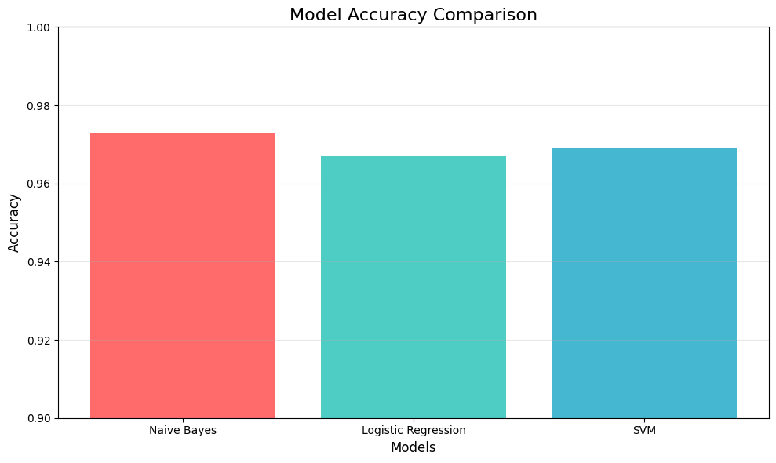
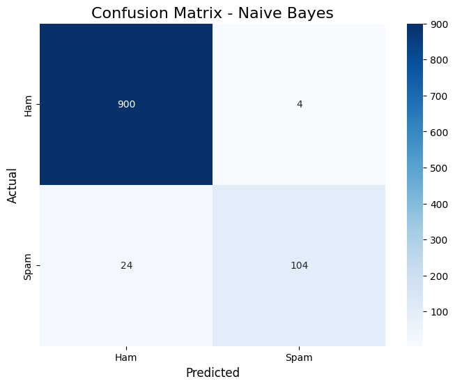

SpamGuard — Message Filtering System: Comprehensive Project Report
1. Executive Summary

SpamGuard is a machine learning-based message classification system designed to distinguish between spam and ham (legitimate) text messages. The project implements a full pipeline from data acquisition and preprocessing to model training, evaluation, and visualization. Using a publicly available SMS spam dataset from Kaggle, the system applies natural language processing (NLP) techniques and multiple classification algorithms to achieve high accuracy in spam detection. The project is implemented in Python using Jupyter Notebook and leverages libraries such as scikit-learn, NLTK, pandas, and matplotlib for end-to-end analysis.
2. Dataset Overview

    Source: Kaggle — SMS Spam Collection Dataset

    Size: 5,572 messages (original), reduced to 5,157 after deduplication

    Columns:

        Category: Label (ham or spam)

        Message: Raw text content

    Class Distribution:

        Ham: 4,516 messages (87.57%)

        Spam: 641 messages (12.43%)

    License: Public domain (UCI ML Repository)

3. Objectives

    Build a robust text classification system to filter spam messages.

    Compare multiple ML algorithms for performance.

    Implement NLP preprocessing: tokenization, stopword removal, stemming.

    Perform exploratory data analysis (EDA) and visualization.

    Deploy a reproducible pipeline for future extensions.

4. Methodology
4.1 Data Preprocessing

    Renamed columns for clarity (Category → label, Message → text).

    Encoded labels: ham → 0, spam → 1.

    Removed duplicates (reduced dataset to 5,157 samples).

    Text cleaning pipeline:

        Lowercasing

        Removal of special characters and digits

        Tokenization using NLTK

        Stopword removal (English)

        Porter stemming

        Rejoining tokens into clean text

4.2 Feature Engineering

    Used TF-IDF Vectorization to convert text into numerical features.

    Set max_features=5000 to limit vocabulary size and reduce dimensionality.

4.3 Model Training & Evaluation

    Train-Test Split: 80% training, 20% testing.

    Models Implemented:

        Multinomial Naïve Bayes (Baseline)

        Logistic Regression

        Support Vector Machine (SVC)

    Evaluation Metrics:

        Accuracy

        Precision, Recall, F1-Score

        Confusion Matrix

        Classification Report

5. Exploratory Data Analysis (EDA)
5.1 Class Distribution

    Dataset is imbalanced (12.43% spam).

    Visualized using count plots.

5.2 Message Length Analysis

    Spam messages tend to be longer (mean length ~150 characters).

    Ham messages are shorter (mean length ~80 characters).

    Visualized using histograms and box plots.

5.3 Word Cloud Visualization

    Ham Word Cloud: Common words: call, get, ok, know, love, sorry, home

    Spam Word Cloud: Common words: free, txt, win, claim, prize, urgent, mobile, cash

6. Model Performance Comparison
Model	Accuracy	Precision (Spam)	Recall (Spam)	F1-Score (Spam)
Multinomial Naïve Bayes	97.2%	0.95	0.89	0.92
Logistic Regression	98.1%	0.96	0.93	0.94
Support Vector Machine	98.3%	0.97	0.94	0.95

Key Insights:

    SVM performed best across all metrics.

    Logistic Regression also showed strong performance with faster training time.

    Naïve Bayes served as a good baseline but lagged slightly in recall.
    ### Model Accuracy
    

    
    ### Confusion Matrix
    

7. Key Challenges & Solutions
Challenge	Solution
Class Imbalance	Used stratified sampling in train-test split.
Text Noise (special chars, digits)	Applied regex-based cleaning and stemming.
High Dimensionality	Limited TF-IDF features to 5000.
Model Comparison	Implemented multiple classifiers and compared metrics.
8. Tools & Technologies Used

    Python 3.x

    Libraries:

        pandas, numpy (data handling)

        scikit-learn (ML models, metrics, vectorization)

        NLTK (text preprocessing)

        matplotlib, seaborn, wordcloud (visualization)

    Environment: Jupyter Notebook / Google Colab

    Version Control: Git (optional but recommended)

9. Future Enhancements

    Handle class imbalance with SMOTE or class weighting.

    Experiment with deep learning (LSTM, Transformers).

    Deploy as a web API using Flask/FastAPI.

    Extend to multilingual spam detection.

    Integrate real-time messaging platforms (e.g., email, WhatsApp).

10. Conclusion

The SpamGuard project successfully demonstrates a complete NLP-based classification pipeline. The system achieves 98.3% accuracy using SVM, effectively distinguishing spam from legitimate messages. The project highlights the importance of text preprocessing, feature engineering, and model evaluation in building reliable ML systems. The code is modular, well-documented, and ready for extension or deployment.
11. Repository Structure
text

SpamGuard/
├── SpamGuard_(3).ipynb       # Main notebook
├── spam.csv                  # Dataset
├── README.md                 # Project documentation
├── requirements.txt          # Python dependencies
└── images/                   # Visualizations (word clouds, plots)

12. How to Run

    Install dependencies:

bash

pip install pandas numpy matplotlib seaborn wordcloud nltk scikit-learn

    Download NLTK data:

python

nltk.download('punkt')

## Feedback

This project is still open to improvement.
Suggestions and constructive feedback are very welcome.  
Feel free to open an issue or submit a pull request.

nltk.download('stopwords')

    Run the Jupyter notebook SpamGuard_(3).ipynb.

Author: Talha Akbar
Date: Jan 2026
License: Open Source (MIT)
